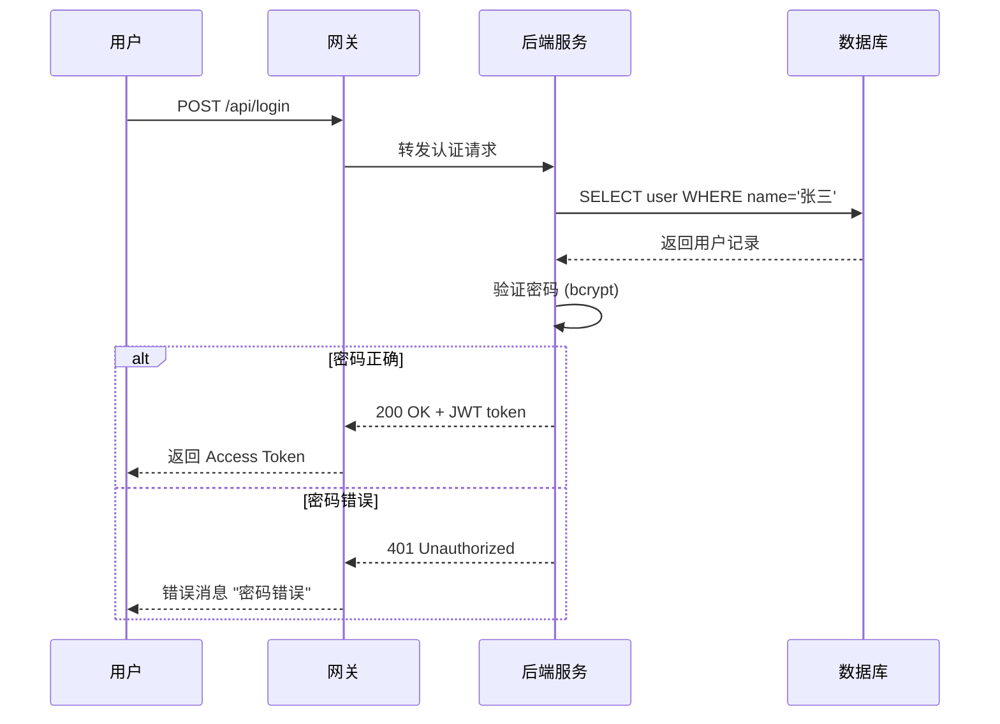
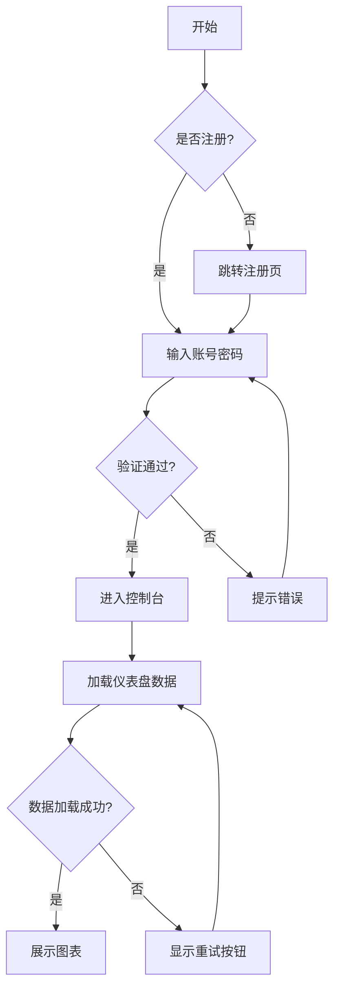
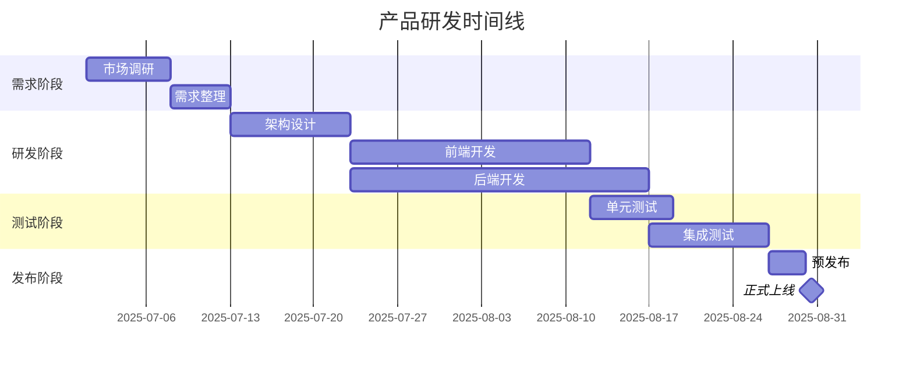

# 📊 复杂 Markdown 格式综合演示（内置测试数据）

> 版本: v4.2.1  
> 生成时间: 2025-07-15 14:30:22  
> 作者: Markdown 演示机器人 🤖

---

## 目录导航

- [1. 表格与对齐](#1-表格与对齐)
- [2. 代码块与语言高亮](#2-代码块与语言高亮)
- [3. 引用与嵌套引用](#3-引用与嵌套引用)
- [4. 列表的混合嵌套](#4-列表的混合嵌套)
- [5. 数学公式（LaTeX）](#5-数学公式latex)
- [6. 流程图与 Mermaid](#6-流程图与-mermaid)
- [7. 任务清单与进度](#7-任务清单与进度)
- [8. 脚注与链接](#8-脚注与链接)
- [9. 自定义 HTML 混合](#9-自定义-html-混合)

---

## 1. 表格与对齐

### 默认对齐表格

| 产品名称 | 单价（USD） | 库存数量 | 销量 | 状态 |
| --- | --- | --- | --- | --- |
| 智能手表 X1 | 199.99 | 152 | 1,204 | ✅ 热卖 |
| 无线耳机 Pro | 89.50 | 34 | 3,875 | 🚚 补货中 |
| 4K 无人机 | 1,249.00 | 8 | 96 | ⚠️ 低库存 |
| 便携充电宝 | 29.99 | 620 | 8,421 | ✅ 热卖 |
| 蓝牙音箱 | 149.00 | 0 | 2,100 | ❌ 下架 |

### 自定义对齐（左/中/右）

| 左侧文字 | 中间数字 | 右侧百分比 |
| :--- | :---: | ---: |
| Alpha 项目 | 42 | 87.3% |
| Beta 项目 | 1,204 | 12.09% |
| Gamma 项目 | 0 | 0.4% |
| Delta 项目 | 77,001 | 100.00% |

### 合并单元格（HTML 实现）

<table>
  <tr>
    <th colspan="3">季度销售汇总（Q3 2025）</th>
  </tr>
  <tr>
    <th>区域</th>
    <th>收入</th>
    <th>利润</th>
  </tr>
  <tr>
    <td rowspan="2">亚太</td>
    <td>$450K</td>
    <td>$120K</td>
  </tr>
  <tr>
    <td>$380K</td>
    <td>$95K</td>
  </tr>
  <tr>
    <td>欧洲</td>
    <td>$720K</td>
    <td>$210K</td>
  </tr>
</table>

---

## 2. 代码块与语言高亮

### Python 示例（含注释）

```python
# 模拟实时股票价格监控
import time
import random

class StockMonitor:
    def __init__(self, tickers):
        self.tickers = tickers
        self.prices = {t: round(random.uniform(50, 500), 2) for t in tickers}

    def update(self):
        """模拟价格波动"""
        for t in self.tickers:
            change = random.uniform(-5, 5)
            self.prices[t] = round(self.prices[t] + change, 2)
        return self.prices

    def alert(self, threshold=10):
        alerts = []
        for t, p in self.prices.items():
            if abs(p - 100) > threshold:
                alerts.append(f"⚠️ {t}: ${p:.2f} 异常波动")
        return alerts

# 用法
monitor = StockMonitor(["AAPL", "TSLA", "GOOG"])
print(monitor.update())
```

### JavaScript / JSON 嵌套

```javascript
// 模拟用户行为追踪
const userSession = {
  userId: "U-2025-001",
  startedAt: new Date("2025-07-15T08:00:00Z"),
  pages: [
    { path: "/home", timeSpent: 12.5 },
    { path: "/pricing", timeSpent: 8.2 },
    { path: "/checkout", timeSpent: 3.4 }
  ],
  metadata: {
    browser: "Chrome 126",
    device: "Desktop",
    isMobile: false
  }
};

console.log(JSON.stringify(userSession, null, 2));
```

### 无语言标记的纯文本代码

```
[INFO] 系统启动成功
[2025-07-15 14:30:22] 已加载 42 个配置项
[WARN] 内存使用率 78%
[ERROR] 数据库连接超时 (timeout=30s)
[DEBUG] 重试第 3 次...
```

---

## 3. 引用与嵌套引用

### 多级引用块

> 💡 提示: 这是第一级引用。
>
> > 📌 深入: 这是第二级引用，可以包含更多内容。
> >
> > > ⚠️ 警告: 第三级引用，通常用于强调。
> > >
> > > - 列表项 1
> > > - 列表项 2
> > > - 列表项 3

### 带引用和代码的复杂引用

> 处理步骤（来自运维手册）：
> 1. 检查设备状态：`systemctl status nginx`
> 2. 查看日志：
>    ```bash
>    tail -f /var/log/nginx/error.log | grep "critical"
>    ```
> 3. 若出现 502 Bad Gateway：
>    - 重启 PHP-FPM：`sudo service php8.2-fpm restart`
>    - 清理缓存：`sudo rm -rf /var/cache/nginx/*`
>
> 执行结果（模拟）:
> ```
> ✅ nginx 运行正常 (pid 8834)
> ✅ PHP-FPM 已重启
> ❌ 缓存清理失败，权限不足
> ```

---

## 4. 列表的混合嵌套

### 有序嵌套无序

1. 项目部署
   - 前端构建
     - `npm install`
     - `npm run build`
     - 产物检查（大小 < 5MB）
   - 后端部署
     1. 进入服务器
     2. 备份旧版本
     3. 上传新包
     4. 重启服务
2. 安全测试
   - 端口扫描（结果：22, 80, 443, 8080）
   - SQL 注入测试
     - 通过 `' or 1=1 --` 检查
     - 行为记录：✅ 已过滤
   - XSS 防护
3. 上线发布
   - 灰度发布 10%
   - 全量发布（如果错误率 < 0.1%）

### 任务清单（GitHub 风格）

- [x] 📊 初始化数据仓库
- [x] 🔄 数据清洗（完成 12,849 条记录）
- [ ] 📈 生成月度报告
  - [ ] 销售趋势图
  - [ ] 客户留存分析
  - [ ] 库存周转率
- [x] 🧪 单元测试覆盖率达 92%
- [ ] 📱 移动端适配
- [ ] 🚀 提交生产环境

### 自定义列表符号（HTML）

<ul style="list-style-type: square">
  <li><b>高优先级</b>: 数据库迁移</li>
  <li><b>中优先级</b>: API 限流设计</li>
  <li><b>低优先级</b>: 旧版文档清理</li>
</ul>

---

## 5. 数学公式（LaTeX）

### 行内公式

质能方程 $E = mc^2$，欧拉公式 $e^{i\pi} + 1 = 0$。

### 块级公式

$$
\int_{-\infty}^{\infty} e^{-x^2} \, dx = \sqrt{\pi}
$$

### 多行公式（矩阵）

$$
\begin{bmatrix}
a_{11} & a_{12} & \cdots & a_{1n} \\
a_{21} & a_{22} & \cdots & a_{2n} \\
\vdots & \vdots & \ddots & \vdots \\
a_{m1} & a_{m2} & \cdots & a_{mn}
\end{bmatrix}
\begin{bmatrix}
x_1 \\ x_2 \\ \vdots \\ x_n
\end{bmatrix}
=
\begin{bmatrix}
y_1 \\ y_2 \\ \vdots \\ y_m
\end{bmatrix}
$$

### 分段函数

$$
f(x) =
\begin{cases}
x^2 + 2x + 1 & \text{if } x \geq 0 \\
\log(-x) + 3 & \text{if } x < 0
\end{cases}
$$

---

## 6. 流程图与 Mermaid

### 时序图（Mermaid）



### 流程图（Mermaid）



### 甘特图（Mermaid）



---

## 7. 任务清单与进度

### 可视化进度（HTML/CSS）

<div style="border: 1px solid #ddd; border-radius: 8px; padding: 16px; background: #f9f9f9;">
  <h4>项目进度总览</h4>
  <p>整体进度: <strong>72%</strong></p>
  <div style="background: #eee; border-radius: 12px; height: 20px; width: 100%;">
    <div style="background: linear-gradient(90deg, #4CAF50, #8BC34A); width: 72%; height: 20px; border-radius: 12px; text-align: center; color: white; line-height: 20px;">72%</div>
  </div>
  <br>
  <p>⏱ 已用时间: 34天 / 预计 47天</p>
  <p>🚨 风险预警: <span style="color: orange; font-weight: bold;">网络延迟任务延期 2 天</span></p>
  <p>✅ 已完成: 15个里程碑 / 21个</p>
  <p>🔥 当前阻塞: 无</p>
</div>

---

## 8. 脚注与链接

这是一个包含脚注的段落[^1]，这里引用了另一个脚注[^2]。

还可以使用链接:

- [访问官网](https://www.example.com "带标题的链接")
- [本地文档](./docs/readme.md)
- [跳转到表格章节](#1-表格与对齐)

脚注定义:

[^1]: 脚注内容 1: 这是脚注的说明文字，通常显示在页面的底部。可以包含 **加粗** 和 *斜体*。
[^2]: 脚注内容 2: 2025年数据来源于内部统计报告。

---

## 9. 自定义 HTML 混合

### 折叠面板（details/summary）

<details>
  <summary>🔍 查看敏感配置（点击展开）</summary>

  <table border="1">
    <tr><th>KEY</th><th>VALUE</th><th>权限</th></tr>
    <tr><td>DB_HOST</td><td>192.168.1.53</td><td>仅运维</td></tr>
    <tr><td>API_SECRET</td><td>******</td><td>仅后端</td></tr>
    <tr><td>REDIS_URL</td><td>redis://cache:6379</td><td>内部</td></tr>
  </table>

  > ⚠️ 请勿泄露此信息
</details>

### 内嵌视频/图片（占位）

<div align="center">
  
  <br>
  <span style="color:gray; font-size:12px;">▲ 图1: 月度活跃用户趋势（模拟占位）</span>
</div>

### 颜色标记与徽章

<span style="background-color: #e7f3ff; padding: 4px 8px; border-radius: 12px; font-weight: bold;">📘 信息</span>
<span style="background-color: #fff3cd; padding: 4px 8px; border-radius: 12px; font-weight: bold;">🟡 警告</span>
<span style="background-color: #f8d7da; padding: 4px 8px; border-radius: 12px; font-weight: bold;">🔴 错误</span>
<span style="background-color: #d4edda; padding: 4px 8px; border-radius: 12px; font-weight: bold;">🟢 成功</span>

---

## 结束语

> 📊 以上是 Markdown 的复杂格式演示，覆盖了大多数常见的复杂场景。  
> 祝你编写顺利！ 🎉
